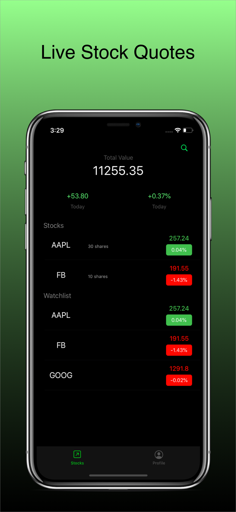
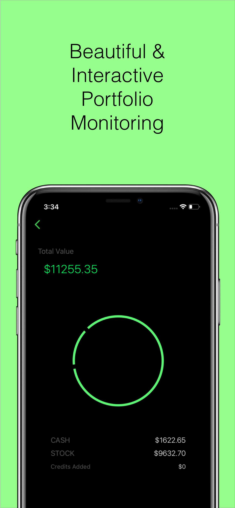
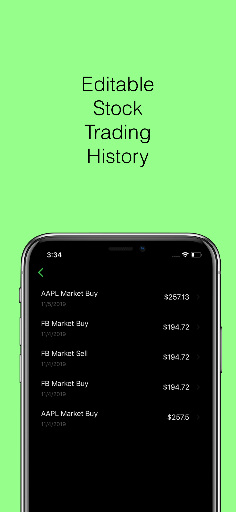

# MarKetUp (Deprecated)
An iOS Stock Market Simulator Using Third Party APIs

Due to the shutdown of the stock API, this applicaiton is deprecated.

## Previews
### Home, Intraday, Virtual Trading, Portfolio Monitor, Purchase History
               

## Stats
Total Downloads on App Store: 500+
